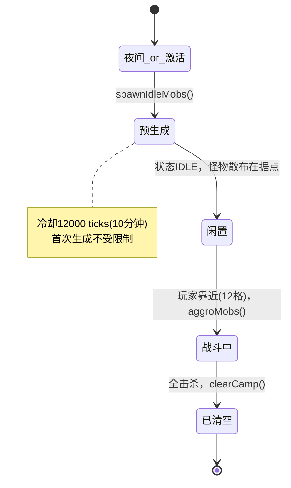

# Camp — 野外据点系统

## 概述

参考《原神》大世界的怪物营地和宝箱机制，在野外分布着怪物据点（Camp）。
每个据点由一群怪物守护，玩家靠近后怪物被激活并攻击，全部击杀后出现宝箱奖励。

**核心理念**：替换原版 Minecraft 的夜间随机刷怪机制，改为固定的、可探索的据点式战斗。
世界上不再有自然游荡的敌对怪物，所有战斗都围绕据点展开。

---

## 一、核心玩法流程

```
大世界探索 → 发现据点 → 靠近触发 → 击杀全部怪物 → 宝箱出现 → 获得奖励 → 据点标记为已清空
```

- **白天**：据点的怪物（包括僵尸）直接暴露在阳光下，僵尸会被晒死。据点处于空闲状态。
- **傍晚/夜间**：被晒死的怪物在夜间自动重生，分散在据点周围各处。玩家靠近即可触发战斗。
- **战斗**：玩家进入据点触发范围（默认 12 格），所有闲置怪物立即锁定玩家并开始攻击。
- **清空**：据点全部怪物击杀后，在据点中心生成宝箱，播放粒子特效和音效。
- **永久标记**：据点清空后永久处于"已清空"状态，不再刷新（除非管理员重置）。

---

## 二、设计理念

| 理念 | 说明 |
|------|------|
| **融入自然** | 据点布置在野外，看起来像是自然生成的一部分 |
| **按需激活** | 玩家靠近前怪物处于空闲状态，不主动攻击 |
| **一次性奖励** | 宝箱被开启后不会再生（可配置定时刷新） |
| **随机组成** | 每个据点的怪物种类和数量随机，不重复 |
| **昼夜循环** | 僵尸白天被晒死，夜间重生，符合原版 Minecraft 规则 |

---

## 三、技术架构

### 3.1 模块关系

```
CampEventHandler (生命周期/事件入口)
    │
    ├─ ServerLifecycleEvents.SERVER_STARTED
    │   ├─ 关闭 doMobSpawning（禁用原版刷怪）
    │   └─ 生成据点候选列表 → CampManager.pendingCamps
    │
    └─ ServerTickEvents.END_SERVER_TICK
        └─ CampManager.tick()
            ├─ processPendingCamps()      → CampWorldGenerator.finalizeCamp()
            ├─ tickIdle()                 → spawnIdleMobs() / aggroMobs()
            ├─ tickFighting()             → 战斗状态更新 / Boss Bar 更新
            └─ tickCleared()              → 计时刷新检查
```

### 3.2 包结构

```
io.github.shade.camp/
├── Camp.java                  # 据点数据模型
├── CampManager.java           # 管理器（CRUD、持久化、Tick 主循环）
├── CampCommand.java           # /camp 命令
├── CampWorldGenerator.java    # 种子生成 + 据点定稿
├── CampRandomizer.java        # 随机怪物组合生成器
├── CampSpawnValidator.java    # 安全位置分析（备用）
├── CampRewardHandler.java     # 宝箱生成 + 特效
└── CampEventHandler.java      # Fabric 事件监听
```

---

## 四、据点定义

每个据点是 `Camp` 类的一个实例，包含以下属性：

| 属性 | 类型 | 默认值 | 说明 |
|------|------|--------|------|
| `name` | String | — | 据点名称（如"废弃原营地1"） |
| `position` | int[3] | — | 据点中心坐标 [x, y, z] |
| `triggerRange` | int | 12 | 触发半径（方块），玩家进入此范围怪物被激活 |
| `mobConfig` | Map<String, Integer> | — | 实体ID → 数量 |
| `lootTable` | String | `minecraft:chests/simple_dungeon` | 宝箱战利品表 |
| `chestPosition` | int[3] | — | 宝箱位置 |
| `status` | Status | IDLE | 当前状态：IDLE / FIGHTING / CLEARED |
| `refreshTime` | int | 0 | 刷新时间（秒），0=永不 |
| `safeSpawnPoints` | List<int[3]> | — | 安全生成点列表 |
| `lastClearedTime` | long | 0 | 上次清空时间（游戏 tick） |

### 运行时字段（不序列化）

| 字段 | 类型 | 说明 |
|------|------|------|
| `activeMobIds` | Set<UUID> | 当前生成的怪物 UUID |
| `activeEntities` | List<Entity> | 当前生成的怪物实体引用 |
| `bossBar` | ServerBossEvent | 屏幕顶部进度条 |
| `enteredFightingTick` | long | 进入战斗的 tick |
| `lastSpawnedTick` | long | 上次生成怪物的 tick（防无限循环，初始 -12000） |

### 状态机

```
IDLE ──(玩家进入范围)──→ FIGHTING ──(全部击杀)──→ CLEARED
  ↑                                                  │
  │                 定时刷新                          │
  └──────────────────────────────────────────────────┘
```

- **IDLE**：怪物已被预生成（夜间）或不存在（白天晒死），玩家可进入触发
- **FIGHTING**：怪物已激活，正在与玩家战斗
- **CLEARED**：所有怪物已死亡，宝箱已生成或已被开启

---

## 五、自动生成（种子算法）

### 5.1 阶段1：候选生成（SERVER_STARTED）

服务器启动时，基于世界种子计算据点候选位置。所有候选以 (x, 64, z) 的近似坐标
存入 `pendingCamps` 列表，等待区块加载后创建。

生成策略：以 (0,0) 为中心，在不同距离和角度均匀分布。

| 距离范围 | 方向数 | 概率 |
|----------|--------|------|
| 100~400 格（内圈） | 4 方向 | 55% |
| 500~1200 格（中圈） | 6 方向 | 40% |
| 1400~2500 格（远圈） | 8 方向 | 30% |

每个方向使用种子同步的 `Random` 确定是否有据点，确保相同种子生成完全相同的布局。
候选位置不依赖任何区块数据，纯数学计算。

### 5.2 阶段2：定稿（区块加载）

```mermaid
PendingCamps → 区块加载 → world.isLoaded()
    → finalizeCamp()
        → 获取真实地表 Y
        → 检查是否在水中（跳过）
        → 创建 Camp 实例
        → 生成随机怪物配置（基于生物群系）
        → 加入 CampManager
    → (夜间 spawnIdleMobs 预生成怪物)
```

---
## 六、据点类型

据点分为 4 种类型，由生成算法根据距离出生点的远近决定：

| 类型 | 生成概率 | 特点 | Boss Bar 颜色 | 战利品 |
|------|---------|------|--------------|-------|
| NORMAL | ~60% | 标准怪物营地，多种怪物组合 | 绿色 | camp_common |
| BOSS | ~10% | 含强化Boss怪物，更多怪物 | 红色 | camp_epic |
| RESOURCE | ~15% | 少量弱怪 + 矿物资源宝箱 | 金色 | camp_resource |
| PUZZLE | ~15% | 中等数量怪物 + 特殊宝藏 | 紫色 | camp_rare |

### 6.1 距离决定
- 出生点 500 格内：主要为 NORMAL 和 RESOURCE
- 500~1500 格：可能出现所有类型
- 1500 格外：BOSS 概率增加

### 6.2 自定义创建
通过命令指定类型：
```
/camp create 我的营地 BOSS
```
省略类型参数时默认创建 NORMAL。

## 七、怪物配置

### 6.1 生物群系 → 怪物池

| 群系 | 可用怪物 |
|------|----------|
| 平原 (plains) | zombie, skeleton, spider |
| 沙漠 (desert) | husk, skeleton, spider |
| 森林 (forest) | zombie, skeleton, spider |
| 针叶林 (taiga) | stray, zombie, spider |
| 沼泽 (swamp) | zombie, spider, slime, witch |
| 丛林 (jungle) | zombie, skeleton, spider |
| 热带草原 (savanna) | zombie, skeleton, spider |
| 雪地 (snowy) | stray, zombie, spider |
| 恶地 (badlands) | husk, skeleton, spider |
| 山地 (mountain) | zombie, skeleton, spider |

### 6.2 随机规则

- **种类数**：1~3 种，从群系池中随机抽取
- **每种数量**：1~3 只，独立随机
- **总数**：3~8 只，系统自动调整
- **远处难度**：距出生点 >1500 格的据点，怪物数量 +1

### 6.3 预生成与激活

#### 宝箱等级

根据据点怪物总数决定宝箱等级：

| 怪物总数 | 等级 | 宝箱外观 | 战利品表 | 特效 |
|----------|------|----------|----------|------|
| 3~4 | COMMON | 普通木箱 | `camp_common` | 绿色粒子 |
| 5 | UNCOMMON | 普通木箱 | `camp_uncommon` | 末地烛粒子 |
| 6~7 | RARE | 普通木箱 | `camp_rare` | 末地烛 + 挑战音效 |
| 8+ | EPIC | **末影箱** | `camp_epic` | 闪光粒子 + 光柱 |

战利品表文件位于 `data/shadecamp/loot_tables/chests/`，可通过数据包自定义。



- **冷却保护**：两次 spawn 之间至少间隔 12000 tick（10 分钟）
- **首次生成**：`lastSpawnedTick = -12000`，首次生成不受冷却限制
- **怪物消失保护**：战斗中实体消失直接判定清空，不回 IDLE（防无限刷新循环）

---

## 八、动态事件

已清空的据点在一定时间后可能被重新激活。

### 8.1 定时刷新
设置了 refreshTime 的据点会在时间到达后自动重置。

### 8.2 动态重新占领
未设置刷新时间的据点，清空后 10 分钟起每 30 秒有 2% 概率重新占领。
重新占领时通知附近玩家。

### 8.3 营地联动
清空据点时，附近 50 格内其他据点增强：
- 怪物数量 +1
- 触发范围 +4 格

## 九、Boss Bar 进度条


类似末影龙血条，在屏幕顶部显示当前据点的击杀进度。

| 样式 | 说明 |
|------|------|
| **颜色** | 随类型变化：NORMAL绿 / BOSS红 / RESOURCE金 / PUZZLE紫 |
| **样式** | 连续进度条 (`BossBarOverlay.PROGRESS`) |
| **标题** | `⚔ §e{据点名} §r§7[§a已击杀§7/§c总数§7]` |
| **可见范围** | 仅据点范围内的玩家可见 |
| **消失时机** | 离开范围自动隐藏 / 清空后移除 |

进度条通过 `ServerBossEvent` 实现，使用 `Component.translatable()` 支持 i18n。

---

## 十、命令系统

所有命令使用 `Component.translatable()` 进行国际化。

| 命令 | 权限 | 功能 |
|------|------|------|
| `/camp create <name> [type]` | 所有玩家 | 创建据点，可选 NORMAL/BOSS/RESOURCE/PUZZLE |
| `/camp delete <name>` | OP | 删除据点 |
| `/camp list` | 所有玩家 | 列出所有已激活和待生成的据点 |
| `/camp addmob <name> <entity> <count>` | 所有玩家 | 向据点添加怪物 |
| `/camp removemob <name> <entity>` | 所有玩家 | 从据点移除怪物 |
| `/camp setrange <name> <range>` | 所有玩家 | 设置触发范围（5~50） |
| `/camp setloot <name> <loottable>` | 所有玩家 | 设置宝箱战利品表 |
| `/camp reset <name>` | 所有玩家 | 重置据点（刷新怪物和宝箱） |
| `/camp refresh <name>` | 所有玩家 | 刷新安全生成点缓存 |
| `/camp check <name>` | 所有玩家 | 检查据点安全状态 |
| `/camp clearall` | OP | 清除所有据点 |

---

## 十一、替换原版刷怪机制

服务器启动时自动执行 `doMobSpawning = false`，每 5 秒强制检查一次防止被其他模组/命令重新开启。

据点怪物使用 `world.addFreshEntity(entity)` 直接生成，不受 `doMobSpawning` 影响。

**效果：**
- 世界上不再有自然游走的僵尸、骷髅、蜘蛛等
- 所有敌对怪物均来自据点
- 玩家在夜间野外是安全的，除非靠近据点

---

## 十二、国际化（i18n）

位于 `src/main/resources/assets/shadecamp/lang/`：

| 文件 | 语言 |
|------|------|
| `zh_cn.json` | 简体中文 |
| `en_us.json` | English (US) |

所有用户可见消息使用 `Component.translatable("shadecamp.*", args)`。

---

## 十三、数据持久化

据点数据保存到世界存档目录：`<world>/data/shadecamp/camps.json`

格式：
```json
{
  "camps": [ ... ],
  "generatedSeeds": [ "auto_1234567890" ]
}
```

`generatedSeeds` 记录已完成自动生成的种子 ID，避免重复生成。

---

## 十四、文件清单

```
src/main/java/io/github/shade/
├── ShadeMod.java                    # 主入口（修改：注册事件和命令）
└── camp/
    ├── Camp.java                    # 据点数据模型 + Boss Bar
    ├── CampManager.java             # 管理器（CRUD、持久化、Tick）
    ├── CampCommand.java             # /camp 命令（i18n）
    ├── CampWorldGenerator.java      # 种子生成 + 据点定稿
    ├── CampRandomizer.java          # 随机怪物组合生成器
    ├── CampSpawnValidator.java      # 安全位置分析（参考）
    ├── CampRewardHandler.java       # 宝箱生成 + 特效
    └── CampEventHandler.java        # Fabric 事件监听

src/main/resources/assets/shadecamp/lang/
├── zh_cn.json                       # 简体中文
└── en_us.json                       # English

src/main/resources/data/shadecamp/
└── example_camp_data.json           # 示例配置
```

---

## 十五、注意事项

1. **关闭原版刷怪**：`doMobSpawning = false` 是强制性的，每 5 秒检查一次
2. **无限刷新保护**：`lastSpawnedTick` 初始值 -12000，两次 spawn 间隔 ≥12000 tick
3. **实体跟踪**：使用 `activeEntities` 直接持有引用，避免 `world.getEntity(uuid)` 查找失败
4. **战斗保护**：至少 3 tick 后才允许判定"全部击杀"，防止刚生成就被误判
5. **夜间重生**：仅夜间（13000~23000 tick）且无存活怪物时触发